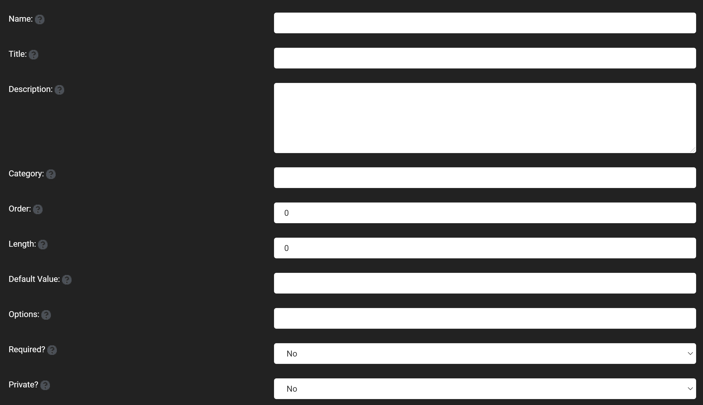

# Profile Management

The profile manager exposes one of the more powerful and under-appreciated features that Oqtane has to offer\. The profile manager expose to you a few features, but the primary feature is the profile editor, which allows you to customize completely the profile fields that a user account has in nearly every way possible\. This is the backbone of all of the user profile features in Oqtane\.
The Oqtane profile manager allows for a user to specify more things about themselves than the typical information from a basic user account\. Fields from the profile can be made to be required upon making an account such as making a name or address a required field\.

The profile page has an add profile button at the top of its page which includes:
* Name: The name of the profile item as it would be accessible in the [database](../host-administration/sql-management.md)\.
* Title: The title of the field displayed to the user\.
* Description: Enter a description for the profile that will be what shows up for the help icon for the field\.
* Category: The name for a grouping of fields such as the name or address headings that are by default included in the profile tab above their respective groupings of fields\.
* Order: Choose the spot where in the list of profile fields thatb this one will appear with 0 being the first position\.
* Lenth: The maximum length that can be input into this field, with a 0 for unlimited length\.
* Default Value: The value that will be put into this field if the user doesn't enter anything into it\.
* Options: Has the ability to create a list of items that can be selected and is enter by a list with commas in between the items \(a,b,c\)\.
* Required?: Specify whether or not the field is required upon the creation of a new account\.
* Private: Specify whether it should be seen by regular user or should just been seen by administrators\.

There is also the option to edit or delete any of the fields that have already been created with edit and delete buttons on each item in the list of profile fields\.
