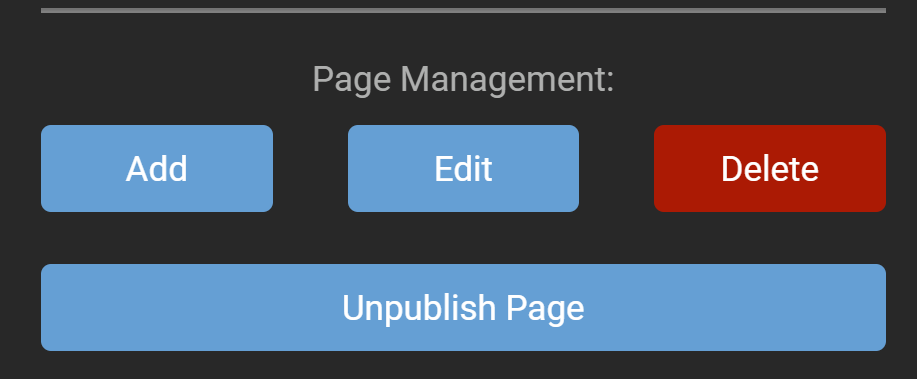

# Control Panel Page Management

The page management feature allows you to manipulate the page you are currently on, by providing options for adding, editing, deleting, and publishing pages.
This feature also has many of the same capabilities as the admin dashboard's [Page Management feature](../admin-dashboard/page-management.md), with the only difference being that the control panel's page manager only has the ability to change the page you are currently on. 

### Add

The add feature adds a new page to your website and brings up the page management window, which allows you to specify the settings, appearance, and permissions for the page you are adding. 
The fields which exist in the page management window are the:

>#### Settings
>Name: Which specifies the name that will be displayed in the navigation bar.
>Parent: Which will specify the page that this page will be underneath, meaning that the added page will be put to the right of the page specified in the navigation bar at the top.
>Insert: Specify where the name for the page will appear in the navigation bar, by saying where the page should appear among all of the children of the parent that has been selected.
>Navigation: Say whether you want the page to be displayed to users that fit within the permissions, or if you want the page to be hidden to everyone but administrators which can be useful while editing a page.
>URL Path: The url is what is put in the web page's address, for example if the url path is set to page1 then the address might be www.website/page1.com. If no URL path is specified then the URL will by default be set to be the same as the name field above.
>Redirect: Input a URL that is the same as the URL path of another page in the site that user will be sent to, remember that if no URL path is specified for another page then the name will be used. If this feature is implemented then you will not be able stay on the page to use the control panel's page manager, so you will need to use the admin dashboard's [page management feature](../admin-dashboard/page-management.md) to edit or delete page's with this feature.

>#### Appearance
>Title: The name that is displayed on the web page's tab.
>Theme: The theme that the web page will take on from a selection of styles and colors that can be downloaded by the host user in the [theme manager](../host-administration/theme-management.md).
>Layout: The amount of content panes that will be available. Which are basically how many columns will be available to have content and modules inserted inside of.
>Default Container: Choose the layout of modules for the page, like hw the titles typically displayed above the modules will be.
>Icon: Input a favicon address or other icon address to include an icon beside the name of your page.
>Personalizable: This feature gives a page that is unique to every individual and allows them to add modules and edit the content of the page, so only the individual can see what they put onto the page.

>#### Permissions
>View: This is what allows different users to see certain pages and any users that are within certain roles, that can be specified in the admin dashboard's [role management feature](../admin-dashboard/role-management.md) will be able to see or not see the page depending on what you have checked the box for the role they fit into.
>Edit: This allows users that fit into the specified roles to be able to edit pages using the [content editor](../SiteAdministration/content-editor.md).
>Specific Users: The permissions tab also has the ability for you to enter a specific username and allow for you to set custom permissions for any specific users that you want.

### Edit

The edit feature shares all of the same features as the add feature, allowing you to change the settings, appearances, and permissions of any page, with the insert feature being replaced by the move feature. The edit feature also shows you when a page was created and when the page was last edited at the bottom of the page management window.

### Delete

The delete feature will delete the page that you are currently on.

### Publish

The publish feature makes any page public that you have previously specified to be hidden, if you have marked a page as not navigable when the page was created. It is useful to have this feature to be able to work on a page that is hidden from regular users until it is finished and ready to be officially added to the site.