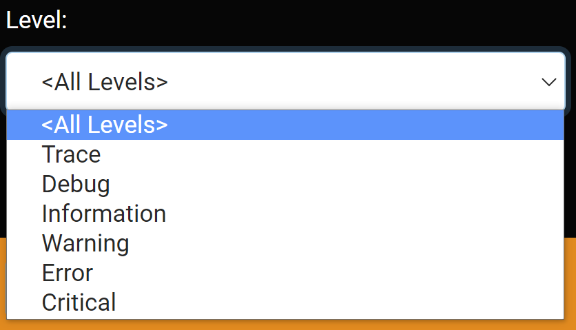
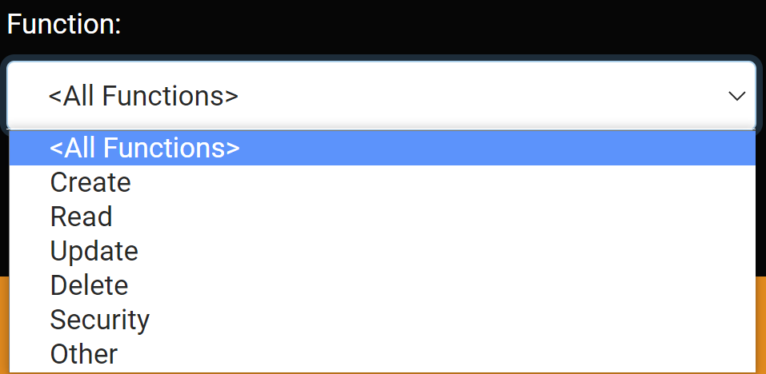

# Event Log

The Event log allows you to know what’s happening on your website at all times.On the surface, the Event log may seem very simple and it is. You have a listing of the most recent events immediately visible on page load. This list is going to be any number of pages with 10 events by default on each page of results and the option to see more rows at a time.

A paging feature at the bottom of the list allows you to move from page to page.
If you want to filter the events to see more or fewer events, you have three controls at the top of the listing to help you. You can filter by the type of event that you want to see with the event Level and Function:

* Level: The level specifies the severity of the event and includes options for:
    * Trace
    * Debug
    * Information
    * Warning
    * Error
    * Critical

* Function: The function is what type of feature is being used and is color-coated for easier viewing. It includes options for:
    * Create
    * Read
    * Update
    * Delete
    * Security
    * Other

* Rows: Choose how many rows you would like to have displayed on page.
The feature and date are also shown in the event list but aren't sortable fields, with the feature showing what part of the Oqtane framework is being used.
For example, you might be interested only in seeing instances of site users attempting to log in. To see this, simply change the Function drop-down list to Security, and only security events like the login event will be shown to you.
In other cases, you might want to see a larger list of events. There are many reasons for this. One reason might be searching for something specific using built-in features of your web browser, such as using Ctrl+F to “find” something in the page. As an example, you could switch the event log to show 100 events by changing the rows.
For each event that is displayed you can select the detail button to show more inforamtion on where the event happened and a more in-depth description on what the event is.