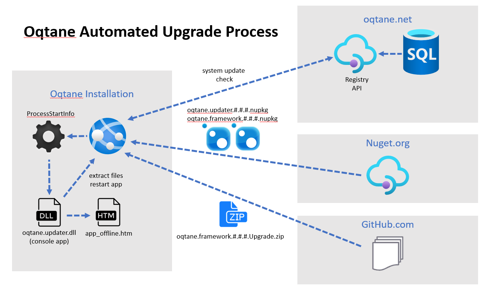

# Upgrading Oqtane

Regularly upgrading Oqtane is crucial to maintain the latest fixes, features, and security patches. Below, you'll find simplified instructions for both manual and automated upgrade processes.

## Manual Upgrade

Performing a manual upgrade ensures full control over the process. Follow these straightforward steps:

### Step 1: Download Upgrade Package

- Visit the [Oqtane Framework releases page](https://github.com/oqtane/oqtane.framework/releases) on GitHub.
- Download the package for your desired version that ends with *.Upgrade.zip (e.g., Oqtane.Framework.5.0.2.Upgrade.zip).

### Step 2: Access Installation Location

- Navigate to the root location where your Oqtane framework files were initially deployed. You can identify this location by files with a .dll extension (e.g., Oqtane.Server.dll).

### Step 3: Stop Oqtane Application

- Depending on your setup:
  - Stop your website using your web server or cloud provider's interface.
  - In IIS (Internet Information Services), stop the corresponding App Pool.
  - For Apache or Linux alternatives, halt the relevant service.
- Alternatively, create an `app_offline.htm` file in the root folder to temporarily shut down your site.

### Step 4:  Replace Files

- Extract all files from the Upgrade.zip package into the root location obtained in Step 2. When prompted, replace existing files with those from the upgrade package.

### Step 5: Restart Oqtane Application

- Restart your Oqtane application:
  - Restart your site using your web server or cloud provider's interface.
  - In IIS, restart the previously stopped App Pool.
  - For Apache or Linux, restart the halted service.
- If you created an `app_offline.htm` file, delete it now. 

### Step 6: Verify Upgrade

- Open your web browser and navigate to your site's URL. The upgrade scripts will automatically execute during application startup.

## Automated Upgrade

Oqtane streamlines the upgrade process for non-technical users with its automated upgrade feature. Follow these steps:

1. Log in to your Oqtane site as the host user.
2. Navigate to the Admin Dashboard via the Control Panel.
3. Choose the "System Update" option.
4.If a newer version is available on Nuget.org, click "Upgrade to #.#.#" to download and perform the upgrade automatically. If you're already up-to-date, you'll see a message indicating this.
5. Alternatively, use the "Upload" tab to manually upload a framework upgrade package to the site and select a button to install it. This method also supports reinstallation or repair of an existing installation with the current version.

_Note: Automated upgrades may fail due to environmental factors. If this occurs, resort to the manual method described above._

#### Oqtane Automated Upgrade Process

By following these instructions, you'll ensure your Oqtane installation stays current with the latest enhancements and security fixes. Remember, stopping the Oqtane application is essential to replace files during the upgrade process. Automated upgrades streamline the process, but manual upgrades provide greater control, especially for custom installations.

## Resources
- [Oqtane Supported Databases](databases.md)
- [Oqtane Installation Resources](resources.md)

[← Back to Installation Home](index.md)

